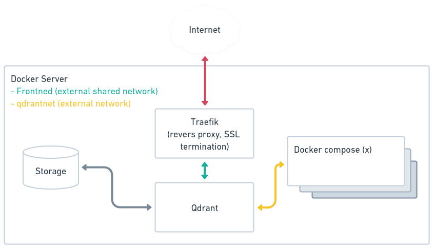

# Qdrant vector store

This is docker compose setup to run qdrant vector store.

## Setup overview



## Configuration

To allow other docker compose setups, running on the same server, to access qdrant without going through the revers
proxy we have to create an extern docker network with the following command. 

```shell
docker network create qdrantnet
```

Before doing `docker-compose --env-file .env.docker.local up -d` or using itkdev-docker-compose-server `idc up -d` you
should crete the environment variable (only server setup and .env is used in local development) `.env.docker.local`
with the following information.

```shell
COMPOSE_PROJECT_NAME=qdrant
COMPOSE_DOMAIN=<FQDN>
QDRANT_API_KEY=<API_KEY>
```

To access qdrant from other compose projects on the server simply add the network to the service that needs access.

```shell
    networks:
      - qdrantnet
```

Then you should be able to access qdrant from the compose project with the servie name in that network.

```shell
http://qdrant:3666
```
or the service name append the network name and prefixed the qdrant namespace.

```shell
http://qdrant-qdrant-1.qdrantnet:3666
```
